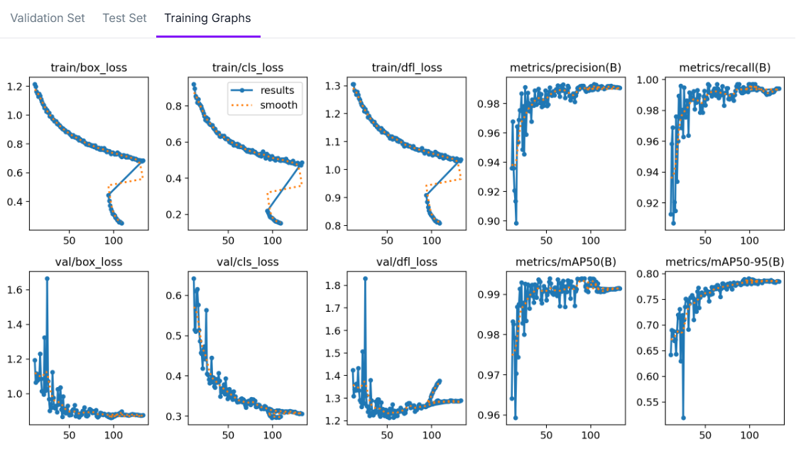
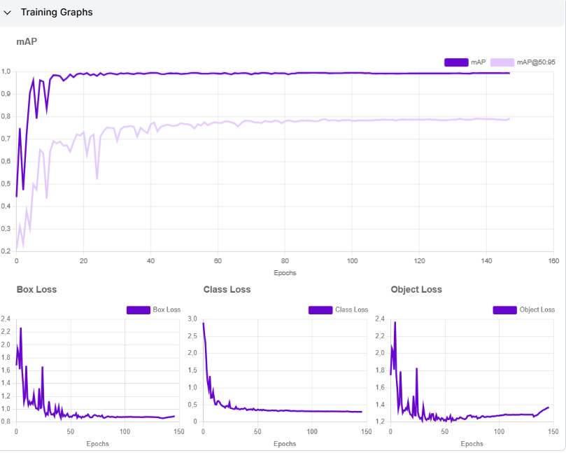

# Modelo de Detección de Lavado de Manos (YOLOv11)

**Detalles sobre la arquitectura de Yolo V11 en detalle [aquí](https://medium.com/@nikhil-rao-20/yolov11-explained-next-level-object-detection-with-enhanced-speed-and-accuracy-2dbe2d376f71)** 

**Informe del proceso completo [aquí](https://unisabanaedu-my.sharepoint.com/:w:/g/personal/santiagotoco_unisabana_edu_co/EcKYvtMhk35MlyTZ53RhrLABUFdKgkWROHxvPJigX_v6CQ?e=i6hhjd)**

[](https://youtu.be/U3cwZligvb4)

## Descripción General

Este repositorio contiene un modelo de detección de lavado de manos entrenado con la arquitectura YOLOv11 en Roboflow 3.0. El modelo está diseñado para detectar técnicas adecuadas de lavado de manos, necesario para tener accesos a la UCI y cumplir con lso protocolos sanitarios y cuidar de los pacientes. 

El modelo logra métricas de rendimiento excepcionales:
- mAP: 99.3%
- Precisión: 99.0%
- Recall: 99.5%



## Conjunto de Datos

El conjunto de datos consiste en imágenes de lavado de manos con las siguientes características:

- **Total de Imágenes**: 7,788
- **Tamaño del Conjunto Original**: 2,975 imágenes
- **División de Datos**: 80% Entrenamiento, 10% Prueba, 10% Validación

### Pasos de Preprocesamiento

Se aplicaron las siguientes técnicas de preprocesamiento para mejorar el rendimiento del modelo:

- **Auto-Orientación**: Aplicada para garantizar una orientación de imagen consistente
- **Redimensionamiento**: Estirado a 640x640 píxeles para dimensiones de entrada uniformes
- **Conversión a Escala de Grises**: Aplicada para reducir la varianza de color y enfocarse en características de forma

### Técnicas de Aumentación

Para aumentar la diversidad del conjunto de datos y mejorar la robustez del modelo:

- **Salidas por ejemplo de entrenamiento**: 3
- **Rotación**: Rotación aleatoria entre -8° y +8°
- **Exposición**: Ajustes aleatorios de exposición entre -8% y +8%

## Arquitectura del Modelo

El modelo utiliza YOLOv11 (You Only Look Once), una arquitectura de detección de objetos de última generación conocida por su velocidad y precisión. La implementación de Roboflow utiliza PyTorch como base para el entrenamiento e inferencia del modelo.

## Proceso de Entrenamiento

Los gráficos de entrenamiento muestran un patrón de convergencia estable:



- **Box Loss**: Comenzó en ~2.2 y se estabilizó alrededor de 0.8
- **Class Loss**: Comenzó en ~3.0 y se estabilizó alrededor de 0.2
- **DFL Loss**: Comenzó en ~1.8 y se estabilizó alrededor de 1.2-1.3

La métrica mAP muestra una mejora rápida en las primeras épocas, alcanzando más del 90% en la época 20, y continuando mejorando gradualmente hasta 99.3% al final del entrenamiento.

## Rendimiento del Modelo

El modelo demuestra un excelente rendimiento en todas las métricas clave:

- **mAP**: 99.3% (Precisión Media Promedio)
- **Precisión**: 99.0% (Exactitud de predicciones positivas)
- **Recall**: 99.5% (Capacidad para encontrar todas las instancias positivas)
- **mAP50**: ~99.5% (mAP con umbral IoU de 0.5)
- **mAP50-95**: ~78% (mAP promedio a través de umbrales IoU de 0.5 a 0.95)

## Uso

### Instalación

```bash
# Clonar el repositorio
git clone https://github.com/tu-usuario/deteccion-lavado-manos.git
cd deteccion-lavado-manos

# Instalar dependencias
pip install -r requirements.txt
```

### Inferencia

```python
# Ejecutar:

python app.py 
```

## Pesos del Modelo

Los pesos del modelo entrenado están disponibles en el directorio `weights`:
- `weights.pt`

## Licencia

[Incluir información de licencia apropiada]

## Agradecimientos

- Roboflow por proporcionar la infraestructura de entrenamiento
- Desarrolladores de YOLOv11 por la arquitectura de detección de objetos
